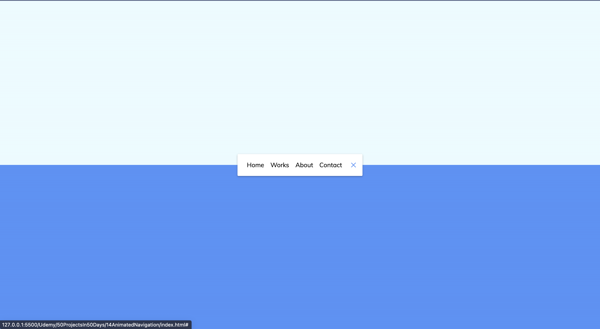

# 50 Projects in 50 Days - Animated Navigation

This is a code along project in the [50 Projects In 50 Days - HTML, CSS & JavaScript Udemy Course](https://www.udemy.com/course/50-projects-50-days/). Sharpen your skills by building 50 quick, unique & fun mini projects.

## Table of contents 😌

- [Overview](#overview)
  - [The project](#the-project)
  - [Screenshot](#screenshot)
  - [Links](#links)
- [My process](#my-process)
  - [Built with](#built-with)
  - [What I learned](#what-i-learned)
  - [Continued development](#continued-development)
  - [Code snippets](#im-really-proud-of-these-code-snippets%EF%B8%8F)
  - [Useful resources](#useful-resources)
- [Author](#author)
- [Acknowledgments](#acknowledgments)

## Overview👋🏾

Welcome to the 14<sup>th</sup> mini-project of the course!

### The project😥

In this project users will be able to:

- Build a responsive site that displays a functional progress bar.

### Screenshot🌇



### Links👩🏾‍💻

- Solution URL: (https://github.com/MaianneThornton/50in50_AnimatedNavigation)
- Live Site URL: (https://loquacious-concha-fcfd0f.netlify.app/)

## My process💭

This is a project that I started by marking out the nav bar and buttons in HTML while creating classes and id's to be later used for styling. Next I began styling the CSS by adding a linear gradient to the background, styling the navbar, buttons and adding animation. I then added functionality by way of JavaScript to toggle between states when the user clicks on the button.

### Built with👷🏾‍♀️

- Semantic HTML5 markup
- CSS custom properties
- Flexbox
- JavaScript

### What I learned👩🏾‍🏫

I learned how to apply an linear gradient! Applying a solid background color just incase the linear gradient is not available ensures that the background will always be colored.

### Continued development🔮

In the future I plan on continuing to practice positioning elements using flexbox, and using different selectors such as nth of type to select elements.

I also plan on continuing to practice using event listeners to make my pages more functional.

I also plan on continuing to practice animating my pages by using the transform and transition properties. 

### I'm really proud of these code snippets✂️

```css
body {
  background-color: #eafbff;
  background-image: linear-gradient(
    to bottom,
    #eafbff 0%,
    #eafbff 50%,
    #5290f9 50%,
    #5290f9 100%
  );
}

nav.active .icon .line1 {
  transform: rotate(-765deg) translateY(5.5px);
}

nav.active .icon .line2 {
  transform: rotate(765deg) translateY(-5.5px);
}
```

### Useful resources📖

- [Resource 1](https://developer.mozilla.org/en-US/docs/Web/CSS/transform) - This is an amazing article which details the transform CSS property. 
- [Resource 2](https://developer.mozilla.org/en-US/docs/Web/CSS/translate) - This is an amazing article which details the translate CSS property. 

I'd recommend both resources to anyone still learning these concepts.

## Author🔎

- Website - [Portfolio Site](https://www.maiannethornton.com/Portfolio/index.html)
- Frontend Mentor - [@MaianneThornton](https://www.frontendmentor.io/profile/MaianneThornton)
- GitHub - [@MaianneThornton](GitHub.com/MaianneThornton)
- Twitter - [@MaianneThornton](https://twitter.com/MaianneThornton)
- LinkedIn - [@MaianneThornton](https://www.linkedin.com/in/maiannethornton/)

## Acknowledgments🙏🏾

Special Thanks go to [Brad Traversy](http://www.traversymedia.com/) and [Florin Pop](http://www.florin-pop.com/) creating the course and making reviewing concepts fun 😊.
